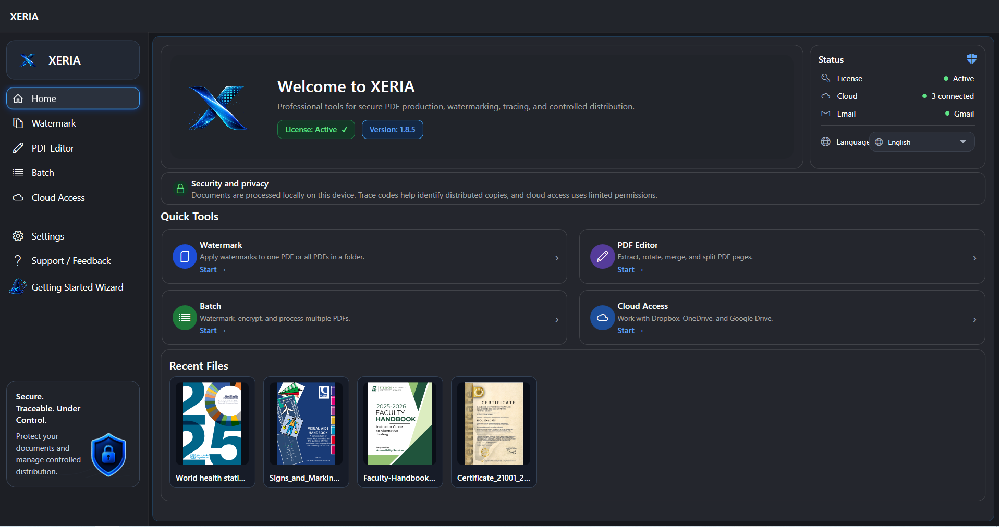

  

# XERIA

Secure PDF distribution with watermarking, source identification, password protection, email delivery, and traceability.

  <a href="https://xeriasoft.com">Official Website</a> •
  <a href="https://apps.microsoft.com/detail/9P37ZD7SQNZP">Microsoft Store</a> •
  <a href="https://xeriasoft.com/downloads/XERIA-setup.exe">Direct Installer</a> •
  <a href="https://xeriasoft.com/#pricing">Pricing</a> •
  <a href="https://xeriasoft.com/video-tutorials.html">Video Tutorials</a>

XERIA is a Windows desktop application designed for organizations that need to distribute confidential PDF documents securely while maintaining traceability and delivery control.

It combines PDF watermarking, source identification, PDF encryption, personalized document generation, email delivery, cloud-connected workflows, and audit logging in a single workflow.

## Download and Installation

### Recommended: Microsoft Store

The recommended way to install XERIA is through Microsoft Store.

https://apps.microsoft.com/detail/9P37ZD7SQNZP

Current Microsoft Store version:

**XERIA 1.8.6**

The Microsoft Store version provides a smoother Windows installation experience and Store-managed updates.

### Alternative: Direct Installer

The standalone Windows installer is also available from the official XERIA website.

https://xeriasoft.com/downloads/XERIA-setup.exe

Current direct installer version:

**XERIA 1.8.3**

The direct installer remains available as an alternative installation method. It may remain on an earlier stable build while Microsoft SmartScreen reputation is being established.

## Current Distribution Channels

| Channel | Version | Status |
|---|---:|---|
| Microsoft Store | 1.8.6 | Recommended |
| Direct Installer | 1.8.3 | Alternative stable installer |

## Latest Updates

### XERIA 1.8.6 — Microsoft Store Release

XERIA 1.8.6 is currently available through Microsoft Store.

This release adds Microsoft Store distribution support and Store-aware update behavior.

### XERIA 1.8.3 — Direct Installer Stable Release

XERIA 1.8.3 is currently available as the direct standalone installer from the official XERIA website.

This version introduced light and dark theme support, improved user interface consistency across the application, and fixed several visual and usability issues.

This update also improved recipient list handling, theme switching behavior, button visibility, hover feedback, and readability in light theme.

## Key Features

* Secure PDF watermarking
* Personalized batch PDF generation
* Recipient-based trace-code watermarking
* Optional QR-based document traceability
* PDF encryption with open and owner passwords
* Controlled printing, copying, and modification permissions
* Single PDF, folder-based, and personalized batch workflows
* Batch email sending with personalized attachments
* Cloud-connected document workflows
* Mail log and delivery tracking support
* Light and dark theme support
* Multi-language user interface
* Windows desktop application

## Screenshots

### XERIA Main Screen

  

### Secure PDF Watermarking

  

### Personalized Batch PDF Generation

  

### Email Delivery and Mail Log

  

## Typical Use Cases

XERIA can be used for:

* Instructor guides and training documents
* Internal company manuals
* Confidential reports
* Recipient-specific PDF copies
* Controlled document distribution
* Traceable PDF sharing
* Secure document delivery by email
* Source identification for redistributed PDF copies
* Batch generation of personalized protected documents

## Official Links

### Official Website

https://xeriasoft.com

### Recommended Download

Microsoft Store:

https://apps.microsoft.com/detail/9P37ZD7SQNZP

### Alternative Direct Installer

https://xeriasoft.com/downloads/XERIA-setup.exe

### Pricing

https://xeriasoft.com/pricing.html

### Video Tutorials

https://xeriasoft.com/video-tutorials.html

### Official YouTube Channel

https://www.youtube.com/@xeriasoft

### Latest GitHub Release

https://github.com/turgaykulgu/xeria/releases/latest

## Documentation

* [Installation Guide](docs/INSTALLATION.md)
* [FAQ](docs/FAQ.md)
* [Security Policy](SECURITY.md)
* [Support](SUPPORT.md)
* [Changelog](CHANGELOG.md)
* [License Notice](LICENSE.md)

## Free Trial

XERIA includes an unlimited free trial.

Users can evaluate PDF watermarking, source identification, document protection, and core document workflow features before purchasing a license.

The trial version has some limitations. Email sending is disabled in trial mode, and generated PDF files include a visible trial banner.

A valid license is required to remove trial banners and enable licensed functionality.

## Security and Trust

The recommended installation method is Microsoft Store:

https://apps.microsoft.com/detail/9P37ZD7SQNZP

The official direct installer is digitally signed and is available from the official XERIA website:

https://xeriasoft.com/downloads/XERIA-setup.exe

For security reasons, XERIA should only be installed from Microsoft Store or downloaded from the official XERIA website.

XERIA does not include bundled adware, browser extensions, cryptocurrency miners, unwanted background payloads, or third-party installers.

If Microsoft Defender, Microsoft SmartScreen, or another security product incorrectly flags the official direct installer, please report the issue to:

[support@xeriasoft.com](mailto:support@xeriasoft.com)

## Publisher and Brand

XERIA is the official product brand of this software.

Official website:

https://xeriasoft.com

The XERIA direct installer is digitally signed.

## License

XERIA is commercial closed-source software.

This repository is provided for public product information, documentation, release notes, security notices, installation guidance, and support references.

This repository does not contain the XERIA application source code.

The XERIA application, installer, binaries, documentation, branding, logos, and related materials are protected by applicable copyright, trademark, and software licensing laws.

## Support

For support, licensing questions, installation issues, download issues, or false-positive security reports, please contact:

[support@xeriasoft.com](mailto:support@xeriasoft.com)

Official website:

https://xeriasoft.com

## Important Notice

Do not download XERIA from unofficial mirrors, repackaged installers, third-party file-sharing websites, or unknown sources.

Recommended installation method:

https://apps.microsoft.com/detail/9P37ZD7SQNZP

Official direct installer:

https://xeriasoft.com/downloads/XERIA-setup.exe
