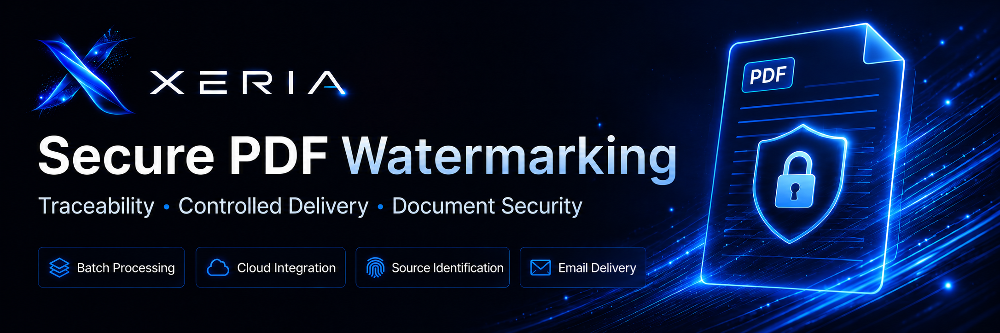
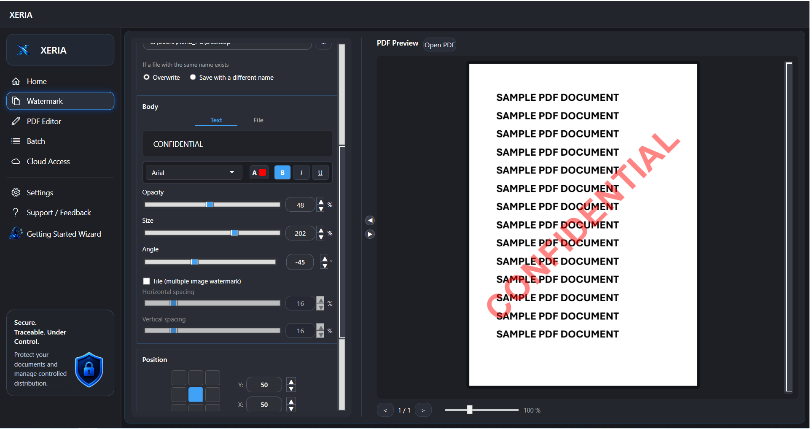
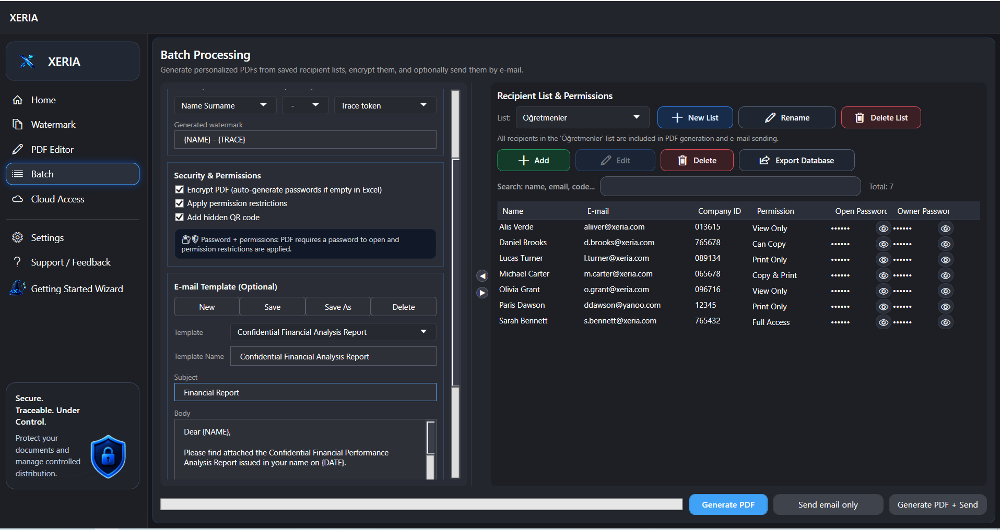
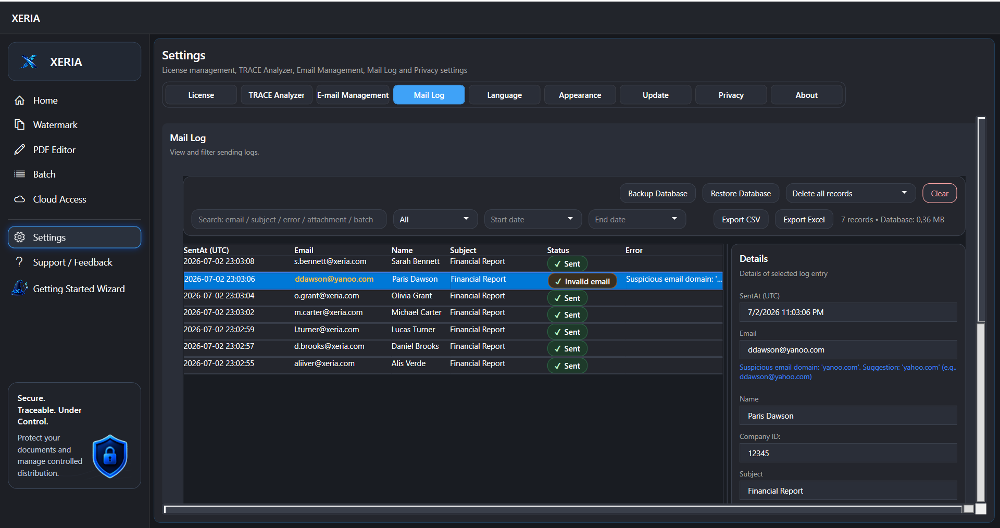

  

# XERIA

Secure PDF distribution with watermarking, source identification, password protection, email delivery, and traceability.

  <a href="https://xeriasoft.com">Official Website</a> •
  <a href="https://xeriasoft.com/downloads/XERIA-setup.exe">Download XERIA</a> •
  <a href="https://xeriasoft.com/pricing">Pricing</a> •
  <a href="https://xeriasoft.com/video-tutorials">Video Tutorials</a>

XERIA is a Windows desktop application designed for organizations that need to distribute confidential PDF documents securely while maintaining traceability and delivery control.

It combines PDF watermarking, source identification, PDF encryption, personalized document generation, email delivery, and audit logging in a single workflow.

## Current Version

XERIA 1.8.3

Released: June 24, 2026

## Latest Update

XERIA 1.8.3 introduces light and dark theme support, improves user interface consistency across the application, and fixes several visual and usability issues.

This update also improves recipient list handling, theme switching behavior, button visibility, hover feedback, and readability in light theme.

## Key Features

* Secure PDF watermarking
* Personalized batch PDF generation
* Recipient-based trace-code watermarking
* Optional QR-based document traceability
* PDF encryption with open and owner passwords
* Controlled printing, copying, and modification permissions
* Single PDF, folder-based, and personalized batch workflows
* Batch email sending with personalized attachments
* Cloud-connected document workflows
* Mail log and delivery tracking support
* Light and dark theme support
* Multi-language user interface
* Windows desktop application

## Screenshots

### Secure PDF Watermarking

### Personalized Batch PDF Generation

### Email Delivery and Mail Log

### Cloud-Connected Workflows

## Typical Use Cases

XERIA can be used for:

* Instructor guides and training documents
* Internal company manuals
* Confidential reports
* Recipient-specific PDF copies
* Controlled document distribution
* Traceable PDF sharing
* Secure document delivery by email
* Source identification for redistributed PDF copies
* Batch generation of personalized protected documents

## Official Links

### Official Website

https://xeriasoft.com

### Official Download

The official XERIA Windows installer is available here:

https://xeriasoft.com/downloads/XERIA-setup.exe

### Pricing

https://xeriasoft.com/pricing.html

### Video Tutorials

https://xeriasoft.com/video-tutorials.html

### Official YouTube Channel

https://www.youtube.com/@xeriasoft

### Latest Release

https://github.com/turgaykulgu/xeria/releases/latest

## Documentation

* [Installation Guide](docs/INSTALLATION.md)
* [FAQ](docs/FAQ.md)
* [Security Policy](SECURITY.md)
* [Support](SUPPORT.md)
* [Changelog](CHANGELOG.md)
* [License Notice](LICENSE.md)

## Free Trial

XERIA includes an unlimited free trial.

Users can evaluate PDF watermarking, source identification, document protection, and core document workflow features before purchasing a license.

The trial version has some limitations. Email sending is disabled in trial mode, and generated PDF files include a trial banner.

A valid license is required to remove trial banners and enable licensed functionality.

## Security and Trust

The official XERIA installer is digitally signed.

For security reasons, XERIA should only be downloaded from the official download page:

https://xeriasoft.com/downloads/XERIA-setup.exe

XERIA does not include bundled adware, browser extensions, cryptocurrency miners, unwanted background payloads, or third-party installers.

If Microsoft Defender, Microsoft SmartScreen, or another security product incorrectly flags the official installer, please report the issue to:

[support@xeriasoft.com](mailto:support@xeriasoft.com)

## Publisher and Brand

XERIA is the official product brand of this software.

Official website:

https://xeriasoft.com

The XERIA installer is digitally signed.

## License

XERIA is commercial closed-source software.

This repository is provided for public product information, documentation, release notes, security notices, installation guidance, and support references.

This repository does not contain the XERIA application source code.

The XERIA application, installer, binaries, documentation, branding, logos, and related materials are protected by applicable copyright, trademark, and software licensing laws.

## Support

For support, licensing questions, installation issues, download issues, or false-positive security reports, please contact:

[support@xeriasoft.com](mailto:support@xeriasoft.com)

Official website:

https://xeriasoft.com

## Important Notice

Do not download XERIA from unofficial mirrors, repackaged installers, third-party file-sharing websites, or unknown sources.

Always use the official download page:

https://xeriasoft.com/downloads/XERIA-setup.exe
